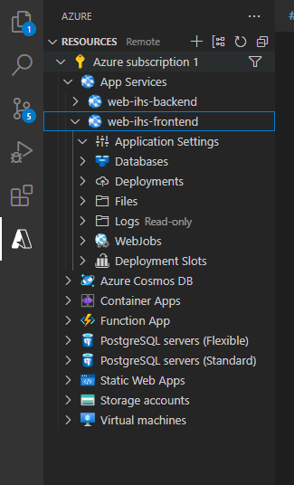
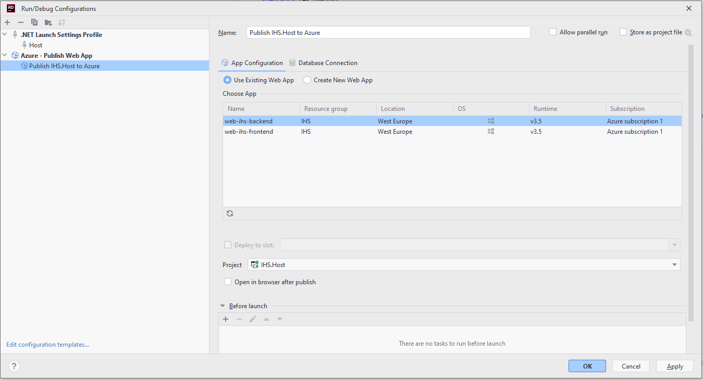
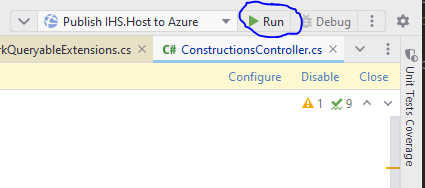

# IhsInteractiveMap

This project was generated with [Angular CLI](https://github.com/angular/angular-cli) version 14.1.3.

## Development server

1. Navigate to `ui/ihs_interactive_map`
2. Run `ng serve` for a dev server.
3. Navigate to `http://localhost:4200/`.

The application will automatically reload if you change any of the source files.

---

## Deployment

> Login to Microsoft Azure https://portal.azure.com/#home -
>
> Use the account that is subscribed to the subscription: Azure subscription 1 (4bea1044-aad6-4ac0-aaed-0d21f08fc2a0)

### Build Prod

Run `npm run build:prod` to build the project in production mode. The build artifacts will be stored in the `dist/`
directory.

### Deploy Webapplication via Visual Studio Code

1. Install Azure Plugin
2. Open Azure Subscription Tab
3. Open App Services
4. Right Click on web-ihs-frontend

5. Click Deploy to Webapp
6. Select the build project in the dist folder

### Deploy Backend via Rider

1. Install Azure Explorer Plugin
2. Setup Run Configuration

3. Press Run

## Running unit tests

Run `ng test` to execute the unit tests via [Karma](https://karma-runner.github.io).

